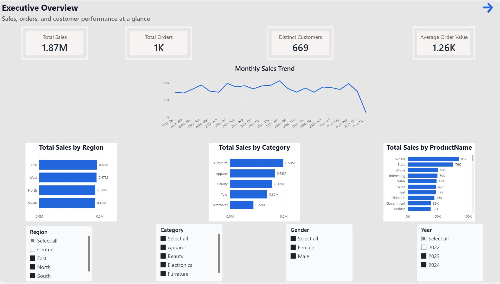

 # Power BI Sales Analysis

## Project Overview

This project demonstrates an end-to-end Power BI sales analytics solution using a real-world sales dataset sourced from Kaggle.

The solution transforms raw transactional sales data into interactive business intelligence dashboards designed to analyse sales performance, customer behaviour, product performance and sales trends.

The project covers the complete Power BI analytics workflow, including data preparation, data modelling, DAX measure development, time intelligence and dashboard design.

## Business Problem

Sales data can contain valuable information about customers, products and business performance, but raw transactional data alone does not provide decision-makers with clear insights.

This project develops an interactive reporting solution to answer business questions such as:

- How much revenue is the business generating?
- How many orders are being placed?
- What is the average order value?
- Which products generate the highest sales?
- Which customers contribute the most revenue?
- How is sales performance changing month over month?
- How does current performance compare with the previous year?
- Which products and customers should management focus on?

The dashboard converts transactional sales data into clear KPIs, trends and performance analysis to support business decision-making.

## Technology Stack

| Technology | Purpose |
|---|---|
| Power BI Desktop | Dashboard development and interactive reporting |
| Power Query | Data cleaning and transformation |
| DAX | KPI calculations and time intelligence |
| Excel / CSV | Source data format |
| Git & GitHub | Version control and portfolio documentation |

## Data Source

The project uses the **Sales Analysis Dataset** sourced from Kaggle.

The dataset contains transactional sales information including:

- Orders
- Customers
- Products
- Sales values
- Quantities
- Order dates

The raw data was imported into Power BI and prepared using Power Query before being used for data modelling, DAX calculations and dashboard development.

> **Note:** The dataset is used for portfolio and educational analysis purposes.

## Data Preparation & Analytics Workflow

The project follows a structured Power BI analytics workflow from raw sales data through to interactive business reporting.

### Analytics Workflow

```text
Kaggle Sales Dataset
        |
        v
   Power Query
Data Cleaning & Transformation
        |
        v
   Data Model
Relationships & Structure
        |
        v
       DAX
KPIs & Time Intelligence
        |
        v
   Power BI
Interactive Visualisations
        |
        v
Sales Performance Dashboard
```

### Data Preparation

The dataset was prepared in Power Query before analysis. The preparation process focused on creating a clean and consistent dataset suitable for reporting and DAX calculations.

The transformed data was then used to develop business measures and interactive visualisations in Power BI.

## DAX Measures & KPIs

DAX measures were created to calculate key business performance indicators and enable dynamic analysis across products, customers and time periods.

### Core Sales KPIs

- **Total Sales** — total revenue generated from sales transactions
- **Total Orders** — total number of orders
- **Total Quantity** — total quantity of products sold
- **Average Order Value** — average sales value generated per order
- **Distinct Customers** — number of unique customers
- **Distinct Products Sold** — number of unique products sold
- **Average Quantity per Order** — average number of units purchased per order
- **Sales per Customer** — average sales generated per customer
- **Average Selling Price** — average selling price across products

### Time Intelligence

Additional DAX measures were developed to analyse sales performance over time:

- **Sales This Month**
- **Sales Last Month**
- **Month-over-Month (MoM) Growth %**
- **Year-to-Date (YTD) Sales**
- **Previous Year Sales**
- **Year-over-Year (YoY) Growth %**

These measures allow the dashboard to compare current performance with previous periods and identify changes in sales trends.

## Power BI Dashboard

The Power BI report was designed to provide an interactive view of sales performance across customers, products and time.

The dashboard allows users to filter the data and explore key business metrics through KPI cards, charts and detailed visualisations.

### Dashboard Analysis

The report provides analysis of:

- Overall sales performance
- Order volume and quantity sold
- Average order value
- Customer performance
- Product performance
- Monthly sales trends
- Month-over-month sales growth
- Year-to-date sales
- Year-over-year performance
- Top-performing products

Interactive slicers allow users to explore performance across different periods and business dimensions.

## Dashboard Screenshots

### Executive Dashboard

Provides a high-level overview of key sales KPIs and overall business performance.



### Sales Analysis Dashboard

Analyses sales trends and performance over time using key sales metrics and time-intelligence measures.


### Customer Analysis Dashboard

Explores customer purchasing behaviour and identifies customers contributing to overall sales performance.


### Product Analysis Dashboard

Analyses product performance to identify top-performing products and understand their contribution to total sales.


## Key Business Insights

The Power BI analysis identified several important patterns in sales, customer and product performance.

### Executive Performance

- Total sales reached approximately **$1.87M** across the analysed period.
- The business processed approximately **1K orders** from **669 distinct customers**.
- Average Order Value was approximately **$1.26K**, providing an indication of the average revenue generated per transaction.
- Regional sales performance was relatively balanced, with the **East region** recording the highest sales at approximately **$0.48M**.
- **Furniture** was the highest-performing product category, generating approximately **$0.50M** in sales, followed by Apparel and Beauty.
- Monthly sales fluctuated throughout the analysed period, highlighting the importance of monitoring sales trends and period-over-period performance rather than relying only on total sales.

### Customer Insights

- The dataset contains **854 distinct customers** generating approximately **$2.53M in total sales**.
- Average sales per customer were approximately **$2.96K**.
- Female customers contributed approximately **51.65% of total sales ($1.31M)**, compared with **48.35% ($1.22M)** from male customers, indicating a relatively balanced customer mix.
- The **East region** had the largest customer base with **183 customers**, followed by the North with **176**.
- **James Hughes** was the highest-performing individual customer shown in the analysis, generating approximately **$14K in sales**.
- Customer activity fluctuated over time, with several periods of stronger customer growth visible across 2023 and 2024.

### Product Insights

- The analysis covers **100 distinct products**, with approximately **10K units sold** and **$2.53M in total sales**.
- The average selling price across products was approximately **$248.84**.
- **Furniture** was the strongest-performing category, generating approximately **$0.68M in sales** and **2.6K units sold**.
- **Apparel** ranked second, generating approximately **$0.57M in sales** and **2.5K units sold**.
- **Electronics** recorded the lowest category sales among the categories analysed, at approximately **$0.30M**.
- The highest-selling individual product shown was **“Where”**, generating approximately **$105K in sales**, followed by **“State”** at approximately **$98K**.
- Monthly product sales fluctuated throughout the year, with stronger sales periods visible around **April, July and September**.

### Sales Performance Insights

- For the selected **2024 period**, total sales reached approximately **$1.07M**, with an average order value of approximately **$1.27K**.
- The dashboard reports **Year-over-Year Growth of -15.23%** for the selected 2024 period compared with the previous year.
- Monthly sales generally remained around **$90K–$120K**, although performance varied across the year.
- **January and September** were among the stronger sales months shown for 2024.
- The monthly comparison with previous-year sales makes it possible to identify periods where current performance was above or below the prior year.
- Running total analysis provides a cumulative view of sales performance and makes overall sales progression easier to monitor.
- The dashboard combines **YTD, YoY and previous-year DAX measures** to support period-over-period performance analysis.

> **Note:** The 2024 data shown in the dashboard appears to be incomplete, with limited November activity and no December sales displayed. Therefore, the YoY result should be interpreted in the context of the available reporting period rather than as a confirmed full-year decline.

## Data Quality & Validation

Data quality was considered throughout the Power BI workflow to ensure the dashboard produced consistent and meaningful results.

Key validation activities included:

- Reviewing the structure and data types of the imported dataset.
- Preparing and transforming the source data using Power Query.
- Checking that date fields supported time-intelligence analysis.
- Creating DAX measures rather than relying only on automatically aggregated fields.
- Testing measures under different slicer and filter selections.
- Comparing current-period and previous-period results when developing time-intelligence measures.
- Reviewing dashboard totals and visual interactions to identify unexpected results.
- Applying year filters when interpreting sales totals and growth metrics.

Particular attention was given to filter context because KPI values change depending on the selected year, customer, product, category and region.

## Skills Demonstrated

This project demonstrates practical business intelligence and data analytics skills across the complete Power BI reporting workflow.

- **Power BI** — development of multi-page interactive business dashboards
- **Power Query** — data preparation, cleaning and transformation
- **DAX** — development of business KPIs and analytical measures
- **Time Intelligence** — YTD, previous-year, MoM and YoY performance analysis
- **Data Modelling** — structuring data for effective reporting and analysis
- **Data Validation** — checking measures, filter context and dashboard results
- **Sales Analytics** — analysis of revenue, orders, customers and products
- **Customer Analytics** — analysis of customer contribution, demographics and regional distribution
- **Product Analytics** — evaluation of product and category performance
- **Business Intelligence** — transforming transactional data into decision-support information
- **Dashboard Design** — creation of clear KPI cards, trends, comparisons, slicers and interactive visuals
- **Git & GitHub** — project documentation and portfolio presentation

## Project Conclusion

This project demonstrates the development of an end-to-end Power BI sales analytics solution, transforming transactional sales data into interactive and decision-focused business reporting.

Through Power Query, data modelling and DAX, the project provides analysis across sales performance, customers, products, regions and time periods.

The dashboard enables users to monitor key performance indicators, investigate performance trends, compare current and previous periods, and identify important customer and product patterns.

The project demonstrates my ability to move beyond creating visualisations and use data to develop meaningful business insights that can support reporting and decision-making.

## Author

**Duaa Shakhtour**

Data Analytics Portfolio Project